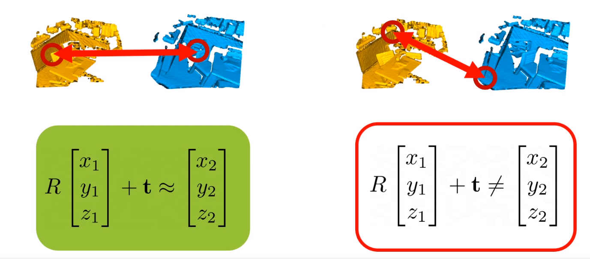

### SAPIEN: A SimulAted Part-based Interactive Environment
- **Oral presentation** [(Video)](http://cvpr20.s3-website-us-west-2.amazonaws.com/CVPR20/CVPR20/511/511-oral.mp4)

- Contributions
    - The paper proposed a simulated environment which enables robotic vision and interaction tasks requiring part-level understanding
    
- Overview
    - 
    - Over 14K articulated parts over 2,346 object models from 46 common indoor object categories.
    
- Motions
    - 
    - Three types of motions : hinge, slider, and screw objects.
        
- Tasks and Benchmarks
    - Robotic Perception
    - 
    - 
    - Robotic Interaction
    - 
    
### High-dimensional Convolutional Networks for Geometric Pattern Recognition
- **Oral presentation** [(Video)](http://cvpr20.s3-website-us-west-2.amazonaws.com/CVPR20/CVPR20/1831/1831-oral.mp4)

- Contributions
    - The paper proposed high-dimensional convolutional networks which can detect subspaces in high-dimensional spaces.
    - Applied ConvNets on 3D registration and image conrrespondence estimation, and outperformed prior approaches.
    
- Overview
    - 

- Experiments
    - Detecting line in hyperspace
    
    - 3D Registration is detecting 3D hyper-plane in 6D
    
    
    - 2D correspondence estimation is detecting conic sections (circle, ellipse, parabola, hyperbola)
    
    
 
