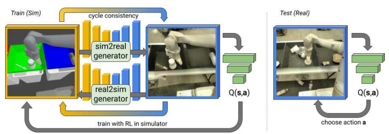
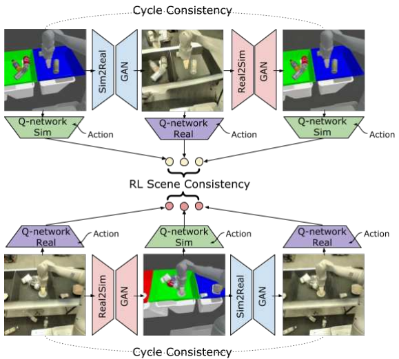
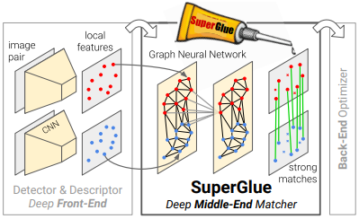
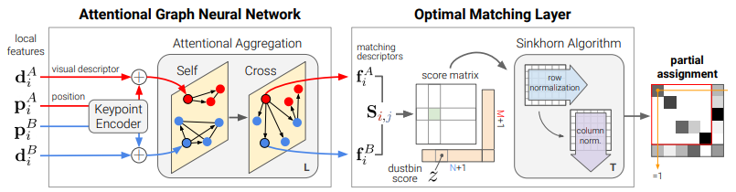

### RL-CycleGAN: Reinforcement Learning Aware Simulation-to-Real
- **Oral presentation** [(Video)](http://cvpr20.s3-website-us-west-2.amazonaws.com/CVPR20/CVPR20/9770/9770-oral.mp4)

- Contributions
    - RL-CycleGAN adapts simulated images to be more realistic while aslo useful for RL using a RL-scene consistency loss
    - Significantly improves data efficiency for real world robotic grasping
    
- Overview
    - 
    
- Method
    - 
    - Use RL-scene consistency loss
            
### SuperGlue: Learning Feature Matching With Graph Neural Networks
- **Oral presentation** [(Video)](http://cvpr20.s3-website-us-west-2.amazonaws.com/CVPR20/CVPR20/7621/7621-oral.mp4)

- Contributions
    - Train a neural network that matches two sets of local features by jointlly aggregating contexts, matching, and filtering non-matchable points.
    - Fast and robust
    
- Overview
    - 

- Method
    - 
    - Aggregates contexts with the self-attention (intra-image information flow) and cross-attention (inter-image information flow)
    - Solve the optimal transport problem with a differentiable matching layer using the Sinkhorm algorithm
    

