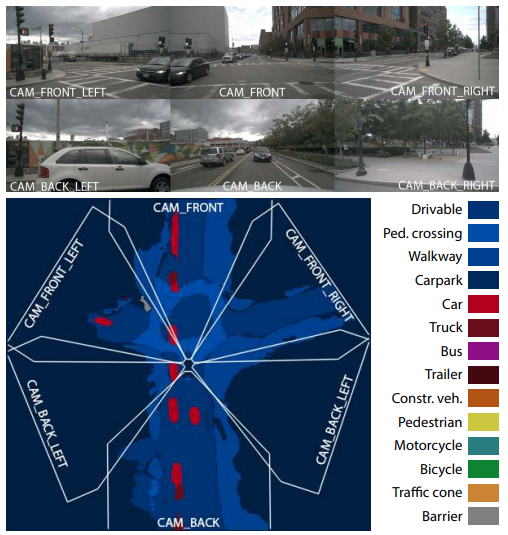
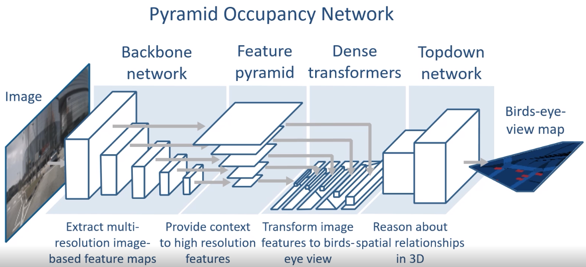
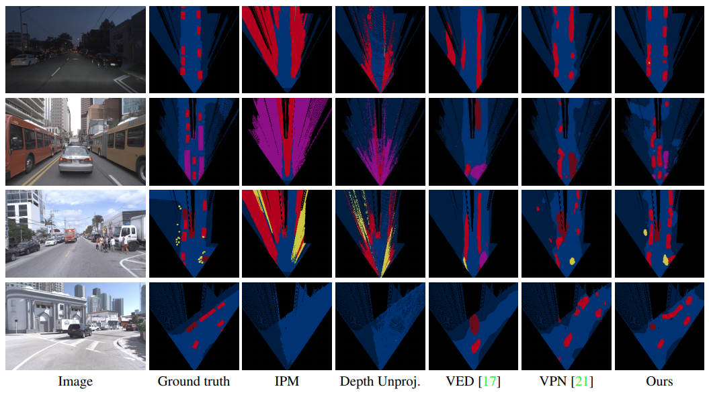
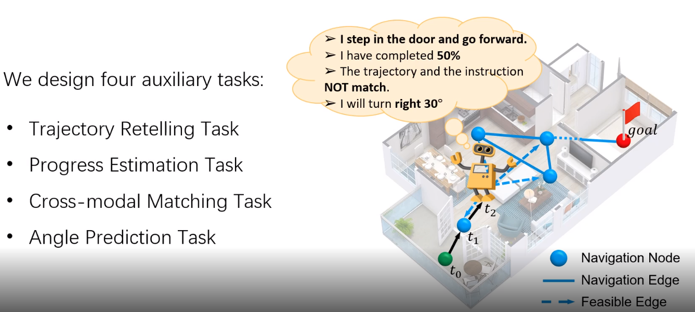
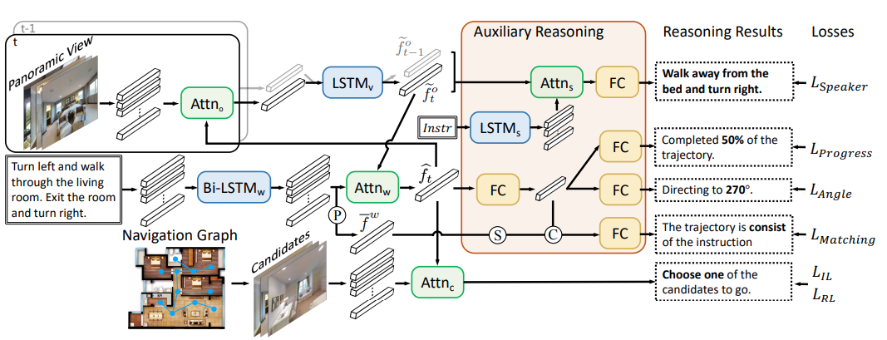
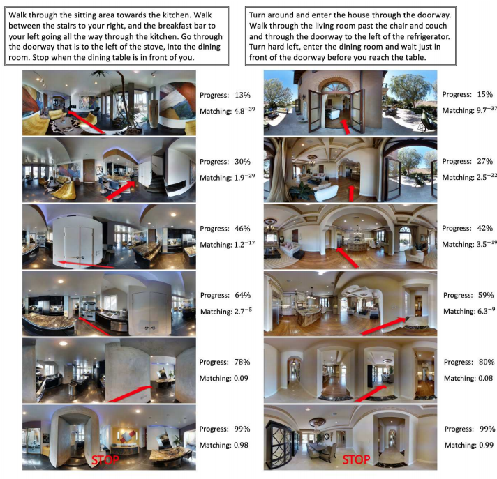

### RL-CycleGAN: Reinforcement Learning Aware Simulation-to-Real
- **Oral presentation** [(Video)](http://cvpr20.s3-website-us-west-2.amazonaws.com/CVPR20/CVPR20/9770/9770-oral.mp4)

- Contributions
    - It proposed a method to generate birds-eye-view semantic map by monocular images
    
- Overview
    - 
    
- Method
    - 
    - Use dense transformer layer
    - Introduce pyramid occupancy network
    - Use semantic occupancy grids
            
- Results
    - 

### SuperGlue: Learning Feature Matching With Graph Neural Networks
- **Oral presentation** [(Video)](http://cvpr20.s3-website-us-west-2.amazonaws.com/CVPR20/CVPR20/7621/7621-oral.mp4)

- Contributions
    - It proposed a method for vision-language navigation which solves auxiliary tasks to take advantage of the additional training signals derived from the semantic information.
    
- Overview
    - 

- Method
    - 
    - Auxiliary tasks
        - Trajectory retelling 
        - Progress estimation
        - Cross-modal matching
        - Angle predictions
    - Graph map
        - Jointly use imitation learning and reinforcement learning for the navigation
    
- Results
    - 
